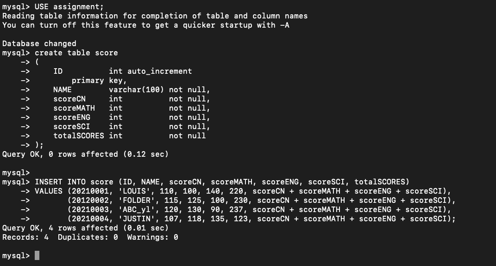

# Student's course score ranking 
# _created By Louis_

### 本地链接好数据库后，请打开***com.StudentRank***下的database文件，复制其内容，粘贴进dos栏或者Terminals，自动生成***assignment.score***表格，并导入初始数据。

### *database*: MySQL

### *user* : root

### *password* : root

## 倘若运行，请运行 ***main.class*** 文件

##### ***com.Test***是测试文件
##### ***com.StudentRank***是调用文件
##### ***main***是主文件
